# Blog App

In this app theres two part one for anyone to read blog and another for only logged in users to post blogs, categories and manage them. Front end is created using `Angular` and `Bootstrap` and backend is created using `ASP.NET` and `JWT` for authentication and authorization.

### Blog

In the home page user will be able to see top featured (max 4) posts and latests (max 6) posts (we are getting that by querying). And there will be a list of categories for user to view post based on the categories. In the single post page where all the details are shown user will be give a list of similar post suggestions.

  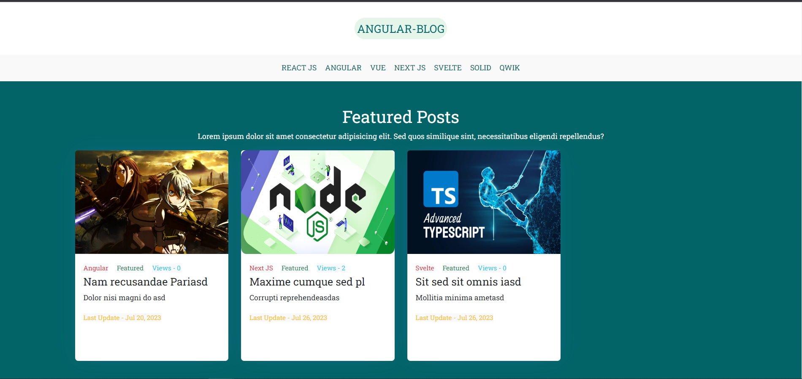
  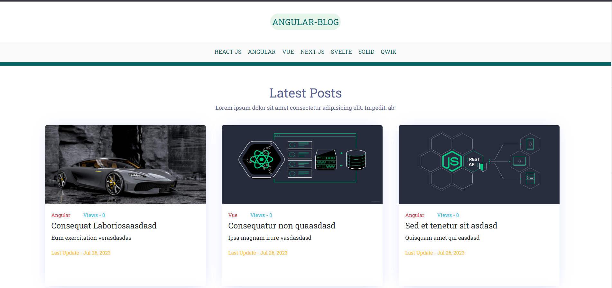
  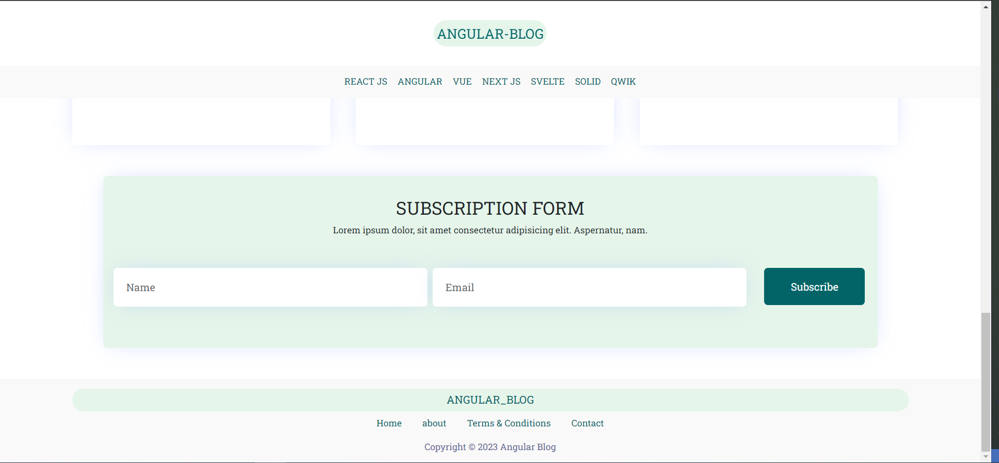
  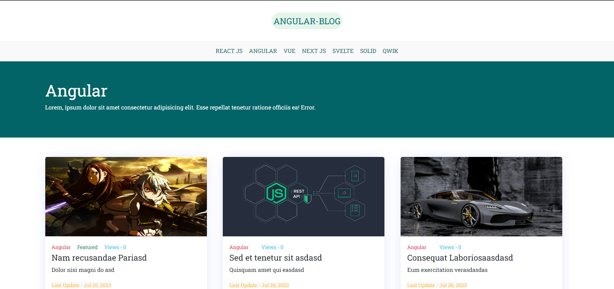
  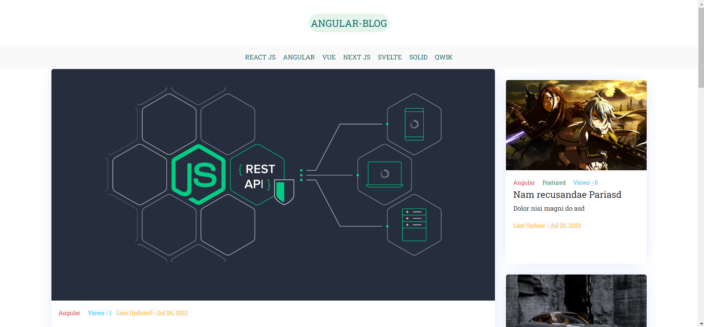

### Dashboard

The dashboard route and sub-routes are secured using auth guard user cant go to these page without logging in. In dashboard home page user will have all the navigation card (i.e category, posts, subscriptions) to goto the specific page to manage these. From category page user will be able to create, update and delete categories same for the posts page and in the subscriptions page user will be able to remove any email from subscription list.

  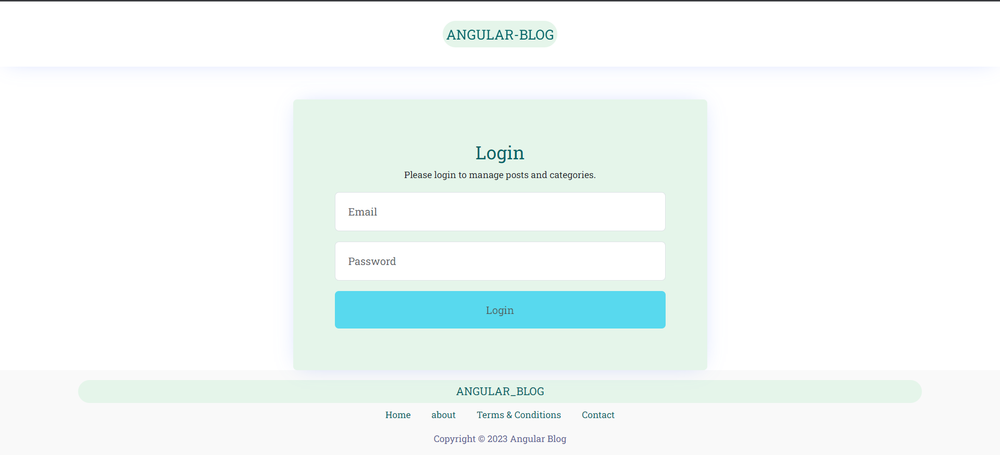
  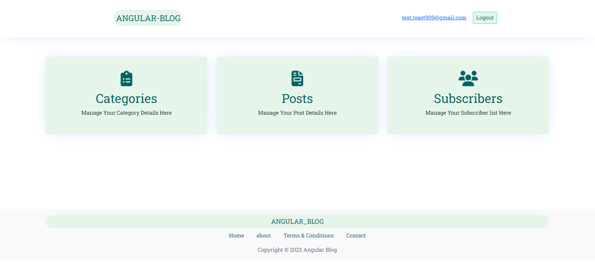
  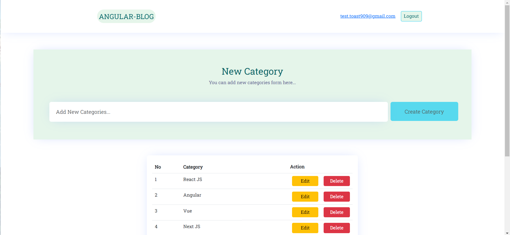
  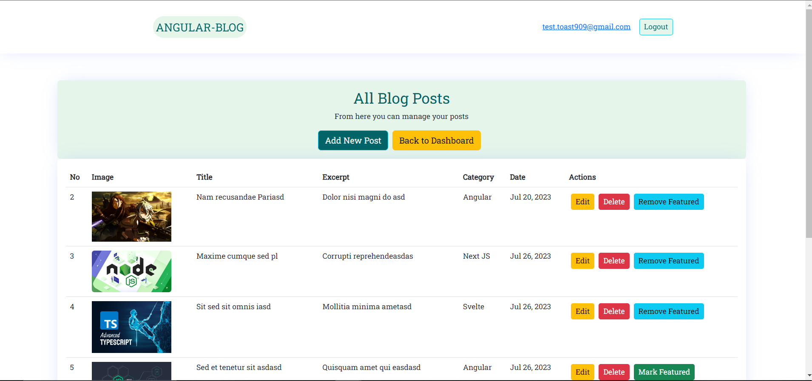
  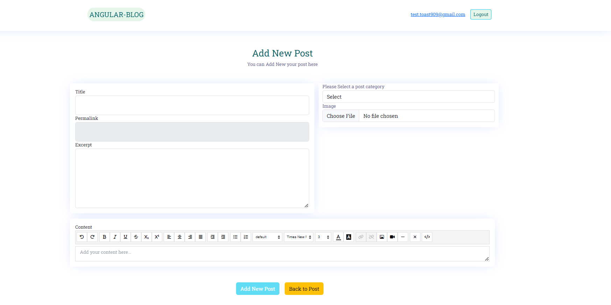
  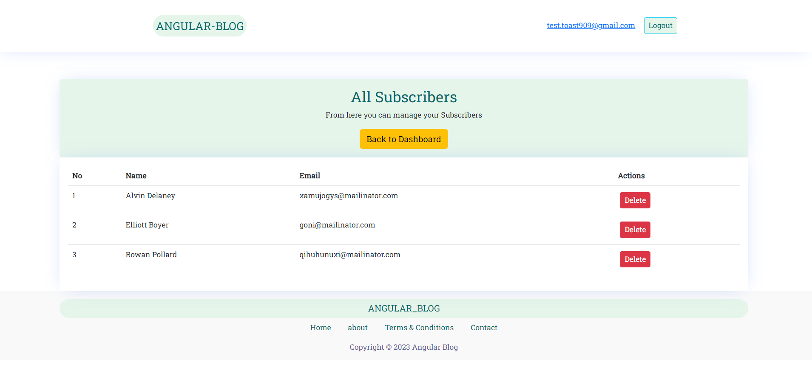

## To Run

1. Open the `Blog.sln` in the server by double clicking.
2. Change the ConnectionStrings Db server in `appsettings.json` in the server Blog.API project.
3. Then run the `Update-Database` to add the migration to the database.
4. Then Run the solution `Ctrl+F5.
5. Open the client folder in terminal and run `ng serve` to run the client and open [http://localhost:4200/](http://localhost:4200/) in the browser.
