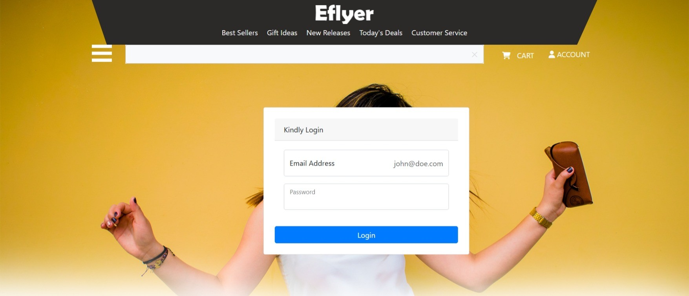

# eCommerce API

A modern eCommerce solution built with .NET 9.0, following Clean Architecture principles with JWT authentication and Stripe payment integration.

## 🚀 Key Features

### User Management

- User registration and authentication with JWT
- Role-based authorization (Admin/User)
- Refresh token support for extended sessions

### Product Management

- CRUD operations for products (Admin only)
- Product categorization
- Product search and filtering

### Shopping Cart

- Add/remove items from cart
- Save cart state
- Checkout process
- Order history

### Payment Processing

- Integration with Stripe payment gateway
- Multiple payment methods
- Secure transaction handling

### Admin Dashboard

- Product management
- Category management
- View order history
- User management

## 🛠️ Built With

### Backend

- **.NET 9.0** - Cross-platform development framework
- **Entity Framework Core 9.0** - ORM for database operations
- **SQL Server** - Database management system
- **JWT Authentication** - Secure user authentication
- **Stripe** - Payment processing
- **Serilog** - Structured logging
- **Swagger/OpenAPI** - API documentation
- **AutoMapper** - Object-object mapping

### Architecture

- **Clean Architecture** - Separation of concerns
- **Repository Pattern** - Data access abstraction
- **Dependency Injection** - Built-in IoC container
- **RESTful API** - Standard API design

## 🏗️ Project Structure

The solution follows Clean Architecture principles with a Blazor WebAssembly frontend:

### Backend

- **eCommerce.API**

  - Controllers
  - Middleware
  - Configuration
  - Entry point

- **eCommerce.Application**

  - DTOs
  - Interfaces
  - Services
  - Business logic

- **eCommerce.Domain**

  - Entities
  - Interfaces
  - Enums
  - Exceptions

- **eCommerce.Infrastructure**
  - Data
  - Identity
  - Services
  - External services (Stripe, etc.)

### Frontend (Blazor WebAssembly)

- **eCommerce.Web**
  - **Pages**
    - Home page with featured products
    - Product listing by category
    - Product search
    - Shopping cart
    - Checkout process
    - User authentication (login/register)
    - Admin dashboard
  - **Components**
    - Navigation menu
    - Product cards
    - Category filters
    - Shopping cart summary
    - User authentication forms
  - **Services**
    - API client services
    - State management
    - Authentication state
    - Local storage integration

## 📚 API Documentation

Interactive API documentation is available via Swagger UI.


## 🖥️ Blazor WebAssembly Frontend

The eCommerce.Web project is a modern single-page application (SPA) built with Blazor WebAssembly, providing a rich, interactive user interface that communicates with the backend API. The frontend project is just to visualize the backend so used a html template for building the site so its ui is not that intuitive.

<p align="center">
  
  
  
  
  
  
  
  
  
  
</p>

### Key Features

#### Shopping Experience

- Intuitive product browsing with category filters
- Advanced search with auto-suggestions
- Persistent shopping cart across sessions
- Secure, multi-step checkout process

#### Admin Dashboard

- Comprehensive product management (CRUD operations)
- Category organization and management
- Order history

#### Technical Highlights

- Built with .NET 9.0 and Blazor WebAssembly
- State management using built-in services
- JWT authentication with refresh tokens
- Responsive design with Bootstrap 5 and custom components
- Client-side caching with IndexedDB for offline support
- Progressive Web App (PWA) with service workers
- SEO optimization with pre-rendering

## 🚀 Getting Started

### Prerequisites

- [.NET 9.0 SDK](https://dotnet.microsoft.com/download/dotnet/9.0) or later
- [Microsoft SQL Server Express](https://www.microsoft.com/en-us/sql-server/sql-server-downloads)
- [Visual Studio 2022](https://visualstudio.microsoft.com/vs/) (recommended) or [VS Code](https://code.visualstudio.com/)
- [Stripe Account](https://dashboard.stripe.com/register) (for payment processing)

### Installation

1. **Clone the repository**

   ```bash
   git clone https://github.com/your-username/ecommerce-api.git
   cd ecommerce
   ```

2. **Configure the application**

   - Update `appsettings.json` in the `eCommerce.API` project:
     - Set your database connection string
     - Configure Stripe API keys
     - Update JWT settings

#### Option A: Using Visual Studio (Recommended)

3. **Open the solution in Visual Studio 2022**

   - Double-click `eCommerce.sln` to open the solution
   - In the Package Manager Console (Tools > NuGet Package Manager > Package Manager Console):
     ```bash
     Update-Database -Context ApplicationDbContext
     ```

4. **Run the application**
   - Press F5 or click the "Start" button to run both projects

#### Option B: Using Command Line

3. **Apply database migrations**

   ```bash
   cd eCommerce.API
   dotnet ef database update
   ```

4. **Run the application**

   - In one terminal, start the API:
     ```bash
     cd eCommerce.API
     dotnet run
     ```
   - In another terminal, start the Blazor WebAssembly app:
     ```bash
     cd eCommerce.Web
     dotnet run
     ```

5. **Access the application**
   - Backend API: `https://localhost:7222/api/`
   - Swagger UI: `https://localhost:7222/swagger`
   - Frontend (Blazor WASM): `https://localhost:7048`
   - Admin Dashboard: `https://localhost:7048/admin` (requires admin privileges)

## 🔒 Authentication

The API uses JWT for authentication. To access protected endpoints:

1. Register a new user via `/api/Auth/create`
2. Login to get a JWT token via `/api/Auth/login`
3. Include the token in the `Authorization` header for subsequent requests:
   ```
   Authorization: Bearer your-jwt-token
   ```

## 📝 Logging

Logging is implemented using Serilog with the following features:

- Console logging
- File logging
- Structured logging for better querying
- Log rotation

Logs are stored in the `Logs` directory by default.

## 🔄 Dependencies

### Main Dependencies

- ASP.NET Core 9.0
- Entity Framework Core 9.0
- Microsoft Identity Core
- JWT Authentication
- Stripe.net
- Serilog
- AutoMapper
- Swashbuckle.AspNetCore
